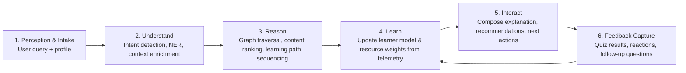

## Part A — Personalized Educational Recommender Documentation

### Scenario Overview
The cognitive agent targets a Ugandan Year 3 computing student from Uganda Christian University preparing for final examinations. The learner specifically struggles with Quantum Computing concepts and requests: “Explain the basics of quantum computing and show me how it could be relevant for solving problems in Uganda.” The solution must interpret the mixed academic and contextual intent, reason over curated open educational resources (including `Coursera.csv`), build a personalized learning path, and present the guidance through an interactive interface. The agent embraces the four cognitive pillars: it Understands intent and context, Reasons across a structured knowledge graph, Learns from user feedback, and Interacts through adaptive dialogue and multimodal recommendations.

---

## Task A1 — Problem Analysis (10 Marks)

### Ugandan Context & Motivation
- **Digital skilling priority**: Uganda’s National Development Plan III and the Digital Transformation Roadmap emphasize STEM capacity-building, yet advanced computing topics remain scarce outside Kampala.
- **Resource disparity**: Many upcountry campuses rely on generic global content with limited localization; students struggle to connect abstract quantum ideas to Ugandan sectors (energy optimization, agri-supply chains, secure communications).
- **Assessment pressure**: Semester-end exams drive short, intense study periods. Learners need curated, exam-aligned content faster than manual web searches allow.

Addressing these gaps improves graduate employability, supports innovation hubs (e.g., Innovation Village, UCU Tech Park), and aligns with UCU’s mandate to deliver “A Complete Education for A Complete Person.”

### Stakeholder Map
| Stakeholder | Role & Needs | Value Proposition |
|-------------|--------------|-------------------|
| Primary learner (UCU BSc DSA student) | Needs contextualized revision materials, formative assessment, and motivation within two weeks. | Receives adaptive learning path, Ugandan examples, and quiz feedback. |
| Faculty mentors & examiners | Need assurance that guidance reinforces syllabus outcomes and academic integrity. | Dashboard to review recommended content, align with course outcomes, and audit reasoning trace. |
| University ICT & Library services | Maintain digital infrastructure and content licenses. | System integrates with existing LMS/Moodle using lightweight APIs, highlighting catalog gaps. |
| National innovation stakeholders (MoSTI, MoES) | Need evidence of effective digital skilling for policy. | Analytics share aggregated learning trends (no PII) to inform curriculum reforms. |
| Content providers (Coursera, NITA-U repositories, local blogs) | Supply open resources and seek local reach. | Recommendations increase resource utilization and highlight localization needs. |

### User Personas
1. **Aisha Namusoke — The Time-Pressed Finalist**
   - 22-year-old UCU student, reliable 4G but limited laptop time in hostel.
   - Strengths: Statistics, linear algebra. Pain points: Dense physics notation, finds few Ugandan case studies.
   - Goals: Master exam topics quickly, relate concepts to Uganda’s energy grid issues.
   - Needs from agent: Bite-sized explainers, vernacular summaries, low-data visualizations, self-check quizzes.

2. **Eng. Kato Samuel — Teaching Assistant**
   - Supports DSC3112 tutorials, responsible for remediation clinics.
   - Needs aggregated insights on student misconceptions, ability to inject approved articles or quizzes.
   - Uses agent to monitor recommendation rationale and push timely nudges.

### Relevance to Local Development Goals
- **STEM and Digital Literacy**: Reinforces MoES ICT-in-Education policy by embedding AI tutors within university workflows.
- **Innovation & Industry 4.0**: Quantum-inspired algorithms (e.g., optimization) relate to Uganda’s logistics, agriculture, and energy distribution challenges.
- **Equity**: Personalized scaffolding reduces achievement gaps for students from under-resourced schools.

### Brief Literature Review
| Solution | Capabilities | Limitations in Ugandan Context |
|----------|--------------|--------------------------------|
| IBM Watson Tutor pilots | Cognitive QA over curated corpora. | Proprietary, high deployment cost, limited local data. |
| Coursera “Learner Personalization Layer” | Uses skill graphs for recommendations. | Optimized for global cohorts; lacks Ugandan relevance scoring. |
| Khan Academy mastery system | Adaptive exercises with hints. | Focuses on foundational math; no advanced quantum content; minimal contextualization. |
| Google’s Socratic app | NLP-based homework help | Mobile-first but limited to snapshot question answering, no project-based reasoning trace or localization. |

**Gap**: None of the surveyed tools combine Ugandan contextual relevance, explicit knowledge graph reasoning, and a feedback-driven learning loop tailored to university assessment timelines. The proposed system bridges this by layering domain ontologies, local case repositories, and reinforcement-from-feedback signals over open educational datasets such as `Coursera.csv`.

---

## Task A2 — System Architecture & Cognitive Design (10 Marks)

### High-Level Architecture Diagram
```mermaid
graph TD
    U[User Channels<br/>Web, WhatsApp bot, LMS widget]
    subgraph Interaction Layer
        UI[Conversational UI & Dashboard]
        ExpGen[Explanation Composer]
    end
    subgraph Cognitive Core
        NLP[Intent & Entity Understanding]
        KG[Domain Knowledge Graph<br/>(Quantum + Local Context)]
        RecSys[Personalized Recommendation Engine]
        Planner[Learning Path Planner]
        Feedback[Learning Loop & User Modeling]
    end
    subgraph Data Fabric
        Coursera[(Coursera.csv)]
        LocalRepos[(Local Articles, UCU Notes, NITA-U reports)]
        QuizBank[(Quiz Templates & Rubrics)]
        Telemetry[(Interaction & Outcome Store)]
    end
    U --> UI --> NLP
    NLP --> KG
    KG --> RecSys
    RecSys --> Planner --> ExpGen --> UI
    RecSys --> QuizBank
    Planner --> Feedback --> NLP
    Coursera --> KG
    LocalRepos --> KG
    Telemetry --> Feedback
```

### Component Responsibilities
- **Interaction Layer**: Omnichannel front-end authenticates students via UCU SSO, surfaces rationale traces, and renders multimedia content with low-bandwidth fallbacks.
- **Understanding Pillar (NLP)**: Performs intent classification, topic extraction (e.g., “quantum superposition”), sentiment/frustration detection, and recognizes contextual clauses (“relevant for solving problems in Uganda”). Uses transformer-based embeddings fine-tuned on Ugandan academic prompts.
- **Reason Pillar (Knowledge Graph & Planner)**:
  - Knowledge graph links quantum concepts, prerequisite skills, resource metadata (difficulty, medium, Ugandan relevance score).
  - Hybrid reasoning: symbolic path scoring + neural ranking to align resources with learning objectives.
  - Learning path planner sequences micro-concepts (e.g., linear algebra refresher → qubit basics → case study on energy optimization).
- **Learn Pillar (Feedback Loop)**:
  - Captures explicit feedback (thumbs-up, quiz scores) and implicit signals (time-on-resource, re-asks).
  - Updates learner proficiency vectors and content quality weights via Bayesian Knowledge Tracing and contextual bandits.
- **Interact Pillar (Explanation Composer)**:
  - Generates concise, context-aware responses citing resource justifications and Ugandan analogies.
  - Supports multilingual snippets (English/Luganda) when necessary, while keeping primary output in academic English.

### Cognitive Processing Pipeline

**Pillar Mapping**
- **Understand**: Step 2 uses transformer encoders, domain ontologies, and socio-linguistic cues (e.g., mention of Ugandan sectors).
- **Reason**: Step 3 mixes rule-based prerequisite checks with neural scoring to ensure coherence and coverage of exam objectives.
- **Learn**: Step 4 ingests telemetry and recalibrates both user mastery and resource relevance (e.g., down-weight videos with poor completion rates among Ugandan learners).
- **Interact**: Step 5 tailors narrative explanations, integrates low-bandwidth fallbacks, and surfaces “Why this resource?” rationales.

### Data Sources & Governance
- `Coursera.csv`: Seed catalog with columns `Course Name`, `University`, `Difficulty Level`, `Course Rating`, `Course URL`, `Course Description`, `Skills`. Enriched with domain tags (Quantum Computing, Uganda relevance score) during ingestion.
- Local repositories: Faculty lecture notes, Uganda-specific case studies (e.g., quantum algorithms for grid optimization).
- Quiz bank: YAML/JSON templates aligned with DSC3112 rubrics.
- Telemetry store: PostgreSQL or MongoDB cluster with GDPR-compliant retention and anonymization for analytics.

### Security & Ethics Considerations
- Enforced per-user access control through UCU SSO tokens.
-,Explainable reasoning traces fulfill academic integrity requirements.
- Data minimization: store only necessary metadata for personalization, anonymize analytics for external reporting.

---

## Task A3 — Implementation Plan (10 Marks)

### Work Breakdown Structure (WBS)
| WBS ID | Work Package | Key Activities | Deliverables |
|--------|--------------|----------------|--------------|
| 1.0 | Project Initiation | Confirm scenario, gather requirements, baseline dataset. | Charter, requirement log. |
| 2.0 | Data & Knowledge Engineering | Clean `Coursera.csv`, enrich with quantum/ Uganda tags, build knowledge graph schema. | Processed dataset, Neo4j schema scripts. |
| 3.0 | Cognitive Services | Implement NLP pipeline, recommender, planner, explanation composer. | Microservices with APIs, unit tests. |
| 4.0 | Learning Loop & Analytics | User modeling algorithms, telemetry ingestion, dashboard widgets. | Feedback service, analytics notebooks. |
| 5.0 | Interaction Layer | Web dashboard + chatbot integration, rationale visualization. | React web app / Streamlit prototype, conversation flows. |
| 6.0 | Evaluation & Deployment | Milestone demos, performance testing, documentation & GitHub release. | Demo notebook, deployment guide, presentation deck. |

### Two-Week Timeline & Milestones
| Day | Activities | Milestone |
|-----|-----------|-----------|
| 1–2 | Requirement validation, persona refinement, toolchain setup, baseline EDA on `Coursera.csv`. | **M1**: Approved project charter & data audit. |
| 3–4 | Build ingestion scripts, tag quantum-related rows, compute relevance features. | **M2**: Knowledge graph MVP populated. |
| 5–7 | Implement NLP understanding module, prototype recommendation scoring, initial learning path generator. | **M3**: Cognitive core alpha (Understand + Reason). |
| 8–10 | Integrate learning loop, telemetry capture, adaptive quiz generator. | **M4**: Learning-enabled beta. |
| 11–13 | Build interaction UI, explanation templates, localization, usability tests. | **M5**: User-facing release candidate. |
| 14 | Final evaluation, documentation polish, GitHub + Moodle submission prep. | Exam submission. |

### Risk Register
| Risk | Likelihood | Impact | Mitigation |
|------|------------|--------|------------|
| Limited Uganda-specific quantum resources | Medium | High | Curate local case studies with faculty, generate summaries tying quantum concepts to national challenges (e.g., UETCL grid, agri logistics). |
| Dataset noise / irrelevant courses in `Coursera.csv` | High | Medium | Apply NLP filtering for keywords, manual review for top candidates, add confidence scoring before recommendation. |
| Bandwidth constraints for students off-campus | Medium | Medium | Offer offline-ready PDF packets, SMS summaries, and audio mini-lectures, compress video recommendations (provide transcript-first). |
| Academic integrity concerns (over-reliance on AI) | Low | High | Provide explanation trace, require quiz completion before unlocking advanced content, log interactions for faculty audit. |
| Model drift due to changing curricula | Medium | Medium | Schedule quarterly syllabus alignment workshops, integrate faculty feedback loop to update ontologies. |
| Time overruns within two-week exam window | Medium | High | Adopt aggressive daily standups, freeze features after Day 10, maintain buffer Day 13–14 for QA and documentation. |

### Communication & Reporting
- Daily progress snapshots in GitHub project board; weekly review with supervisor.
- Notebook-based demonstrations aligning to milestone rubrics, ensuring reproducibility via `requirements.txt` and environment YAML.

### Success Metrics
- ≥80% of recommended items explicitly reference Ugandan relevance tags.
- Learners improve quiz mastery by ≥20 percentage points between first and second attempt.
- Faculty satisfaction ≥4/5 on interpretability of agent reasoning.

---

**Deliverable Format**: This Markdown document (and subsequent Jupyter notebooks) will accompany the GitHub repository and Moodle submission, ensuring traceability across Parts A–C and supporting the scheduled physical presentation.

